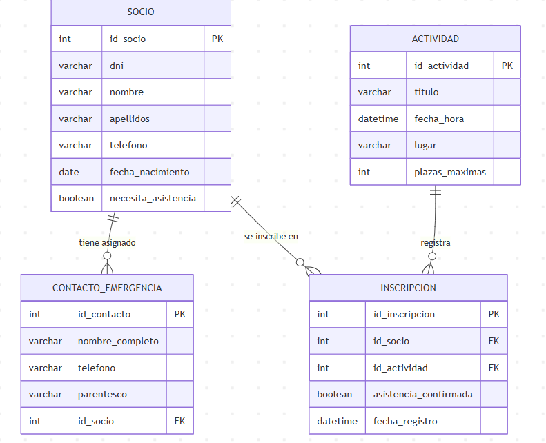

# DOCUMENTACIÓN DEL PROYECTO: SISTEMA DE GESTIÓN DE SOCIOS (ASPACACOR)

Este documento detalla el análisis, diseño e implementación del sistema informático desarrollado para la Asociación de Pacientes Cardiacos de Córdoba (**ASPACACOR**), cubriendo cada uno de los apartados requeridos para la entrega de la práctica.

---

## 1. Análisis del Problema y Diagrama Entidad-Relación (E-R)

### Contexto y Problemática Real
En **ASPACACOR**, la coordinación diaria de actividades (talleres de rehabilitación, charlas médicas, sesiones de gimnasia adaptada) y el control de los pacientes cardiacos (socios) se realizaba de manera tradicional en soporte físico o mediante hojas de cálculo inconexas. Esto provocaba varios problemas:
* **Falta de inmediatez**: Dificultad para localizar rápidamente los contactos de emergencia de un socio ante una indisposición o incidente de salud.
* **Control de aforos ineficiente**: Dificultad para controlar de forma estricta las plazas de las salas donde se realizan las actividades, superando en ocasiones el límite seguro (aforo máximo).
* **Duplicidad de tareas**: Registro manual y repetitivo de las asistencias.

### Proceso Automatizado y Solución Propuesta
Se ha diseñado y desarrollado una solución web centralizada en **Spring Boot** que automatiza:
1. El registro digital de socios incluyendo su DNI, datos de contacto, fecha de nacimiento y si requieren asistencia especial.
2. La asignación dinámica de contactos de emergencia directos para cada socio.
3. La creación de actividades con fecha, hora, ubicación y límite de plazas.
4. El proceso de inscripción de socios en actividades, validando de forma autónoma el límite de aforo y evitando que un socio se inscriba dos veces en la misma actividad.
5. Un panel de control gráfico (Dashboard) con estadísticas automáticas y alertas visuales.

### Explicación del Diagrama E-R
El diagrama E-R del problema real se detalla a continuación:



Consta de 4 tablas relacionadas:
* **SOCIO**: Entidad principal. Tiene una relación **1 a N** con `CONTACTO_EMERGENCIA` (un socio puede tener asignados varios contactos de emergencia, pero cada contacto pertenece a un único socio).
* **CONTACTO_EMERGENCIA**: Entidad débil dependiente de Socio. Almacena el nombre, teléfono y parentesco. Posee una Clave Ajena (`id_socio`) no nula.
* **ACTIVIDAD**: Entidad que registra los eventos disponibles y su aforo máximo (`plazas_maximas`).
* **INSCRIPCION**: Entidad asociativa que resuelve la relación **N a M (Muchos a Muchos)** entre `SOCIO` y `ACTIVIDAD`. Almacena la fecha de inscripción y el estado de confirmación de asistencia, enlazada mediante dos Claves Ajenas (`id_socio` e `id_actividad`).

---

## 2. Diseño del Modelo de Datos en Spring Boot

El modelo de datos se ha diseñado utilizando la especificación **JPA (Java Persistence API)** mediante anotaciones sobre clases Java estándar, lo que permite a Hibernate mapear el modelo orientado a objetos directamente con la base de datos SQL.

### Mapeo de Entidades e Integridad
* **Claves Primarias (PK)**: Todas las entidades utilizan un identificador de tipo `Long` anotado con `@Id` y `@GeneratedValue(strategy = GenerationType.IDENTITY)` para garantizar claves secuenciales auto-incrementales generadas por el motor de base de datos.
* **Claves Ajenas (FK) y Relaciones**:
  * En `ContactoEmergencia`, la relación con Socio se modela con `@ManyToOne` y `@JoinColumn(name = "id_socio", nullable = false)`. Esto asegura que no pueda existir un contacto sin un socio asociado en la base de datos.
  * En `Inscripcion`, se establecen dos relaciones `@ManyToOne` hacia `Socio` y `Actividad` utilizando `@JoinColumn(name = "id_socio", nullable = false)` y `@JoinColumn(name = "id_actividad", nullable = false)`.
* **Políticas de Cascada**:
  * En la entidad `Socio`, la relación con sus contactos está definida como `@OneToMany(mappedBy = "socio", cascade = CascadeType.ALL, orphanRemoval = true)`. Esto significa que si se elimina un socio del sistema, todos sus contactos de emergencia asociados se eliminarán automáticamente en cascada de la base de datos, evitando registros huérfanos.

### Prevención de Bucles de Serialización
Al existir relaciones bidireccionales, la serialización por defecto de Spring Boot a formato JSON causaría un bucle infinito (StackOverflowError). Para solucionarlo, se han utilizado:
* `@JsonManagedReference` en el lado del padre (`Socio`) y `@JsonBackReference` en el lado del hijo (`ContactoEmergencia`).
* `@JsonIgnoreProperties` en los enlazados de `Inscripcion` para omitir la recursión de datos redundantes al listar registros.

---

## 3. Conexión con la Base de Datos

Para asegurar la portabilidad del proyecto sin sacrificar potencia, se ha configurado una base de datos relacional **H2 en memoria**.

La configuración en [application.properties](file:///c:/Users/alvar/Downloads/gestion-socios/gestion-socios/src/main/resources/application.properties) establece:
* `spring.datasource.url=jdbc:h2:mem:aspacacorbd;DB_CLOSE_DELAY=-1`: Define la base de datos `aspacacorbd` persistente en la memoria de la aplicación mientras el servidor esté activo.
* `spring.jpa.hibernate.ddl-auto=update`: Hibernate comprueba el modelo de clases en Spring Boot y crea o actualiza las tablas, claves primarias, claves foráneas e índices automáticamente al arrancar, asegurando que la base de datos siempre esté sincronizada con el código.

---

## 4. Alta de Registros (Inserción)

Se han implementado servicios REST que reciben peticiones en formato JSON desde la interfaz de usuario:

### Lógica de Negocio y Control de Integridad
En [InscripcionController.java](file:///c:/Users/alvar/Downloads/gestion-socios/gestion-socios/src/main/java/com/aspacacor/gestion_socios/controller/InscripcionController.java), al intentar dar de alta una inscripción, la aplicación ejecuta comprobaciones de seguridad:
1. **Comprobación de Plazas**: Cuenta el número de inscritos actuales en la actividad seleccionada. Si es igual o mayor a `plazasMaximas`, detiene la operación y devuelve un código de error `400 Bad Request` indicando que la actividad está completa.
2. **Prevención de Duplicados**: Comprueba si el socio ya tiene un registro de inscripción activo en esa misma actividad. Si es así, rechaza la solicitud para evitar duplicados.

### Flujo del Frontend
El formulario HTML recopila la información del socio o actividad, y la función `fetch()` de JavaScript realiza un envío asíncrono POST:
```javascript
const response = await fetch('/api/socios', {
    method: 'POST',
    headers: { 'Content-Type': 'application/json' },
    body: JSON.stringify(data)
});
```

---

## 5. Visualización de Datos (Lectura)

El sistema cuenta con un panel de control interactivo de alto rendimiento:

* **Peticiones Asíncronas (AJAX/Fetch)**: Al cargar el panel, JavaScript solicita en segundo plano los datos a los endpoints GET `/api/socios`, `/api/actividades` y `/api/inscripciones`.
* **Renderizado Dinámico**: La interfaz procesa el JSON recibido y actualiza el árbol DOM de forma inmediata sin necesidad de recargar la página.
* **Estadísticas en Tiempo Real**: Se calculan contadores dinámicos para mostrar el número total de socios registrados, actividades creadas, número de inscripciones totales y alertas de socios que requieren asistencia especial (ayuda con silla de ruedas, acompañamiento, etc.).
* **Buscador Reactivo**: Un campo de texto filtra instantáneamente la tabla de socios por nombre, apellidos o DNI a medida que el usuario escribe, acelerando el proceso de consulta.

---

## 6. Gestión de Registros Existentes (Modificación y Eliminación)

El sistema proporciona control total sobre los datos:

* **Modificación (PUT)**:
  * Al editar un socio, el formulario carga sus datos actuales y permite añadir, modificar o quitar contactos de emergencia de forma dinámica. Al guardar, el backend recibe el JSON y actualiza los registros manteniendo la coherencia de las claves.
  * Para las inscripciones, la confirmación de asistencia se realiza mediante un interruptor (*switch*) interactivo en la tabla que llama a una petición PUT rápida para modificar únicamente el estado de asistencia.
* **Eliminación (DELETE)**:
  * Al eliminar un socio, el sistema invoca el método del repositorio JPA. Gracias a la integridad de cascada referencial configurada (`cascade = CascadeType.ALL`), la base de datos elimina de inmediato sus contactos de emergencia y registros de inscripción, garantizando que no queden referencias rotas.
